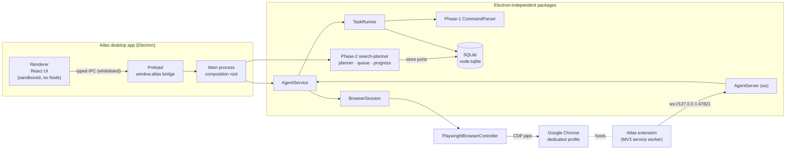
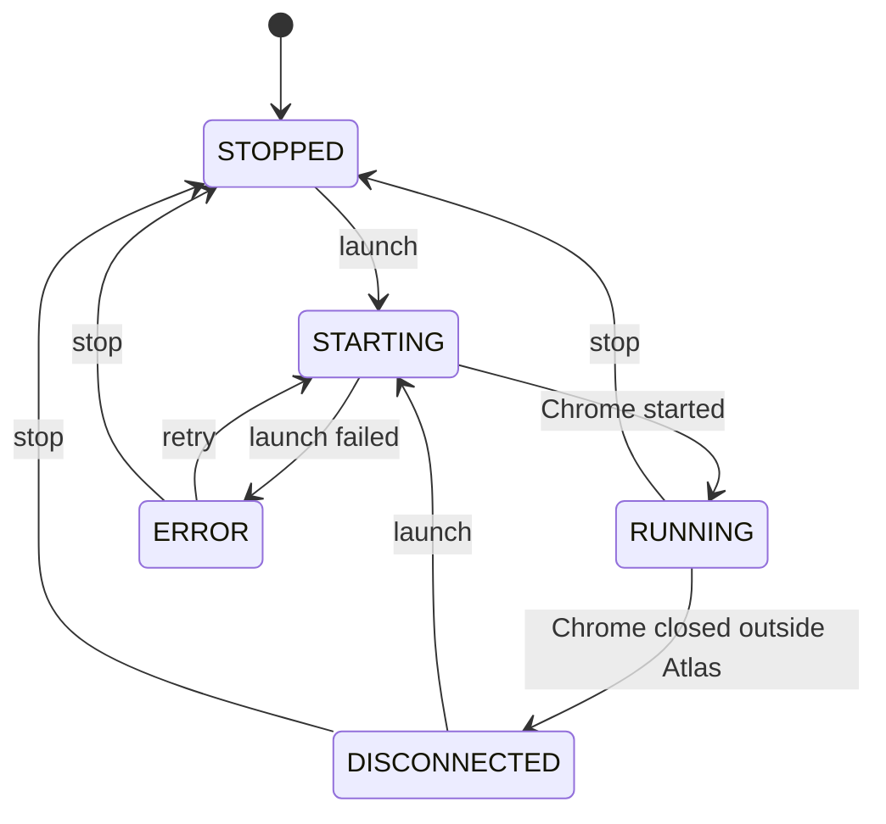
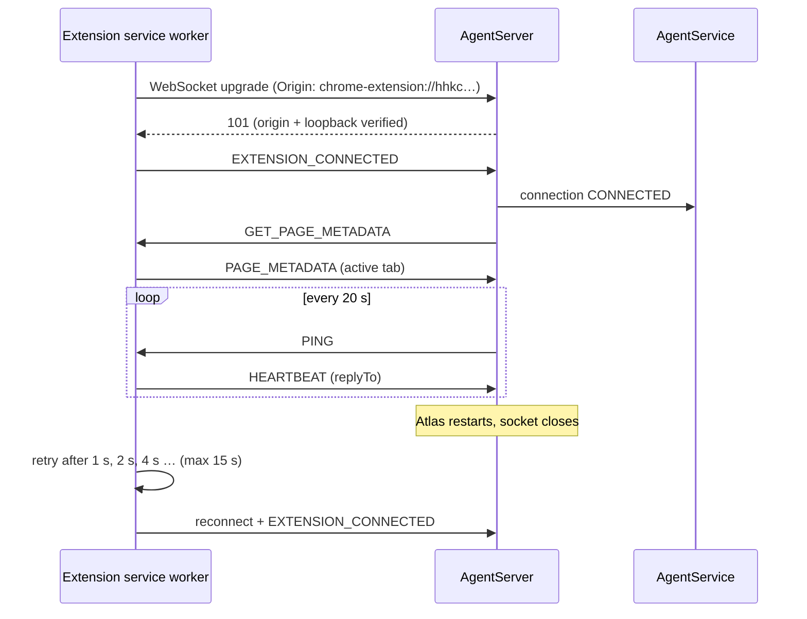
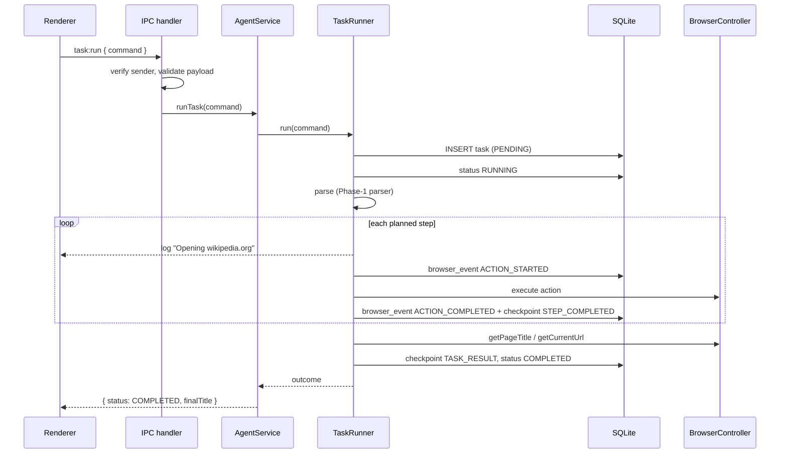
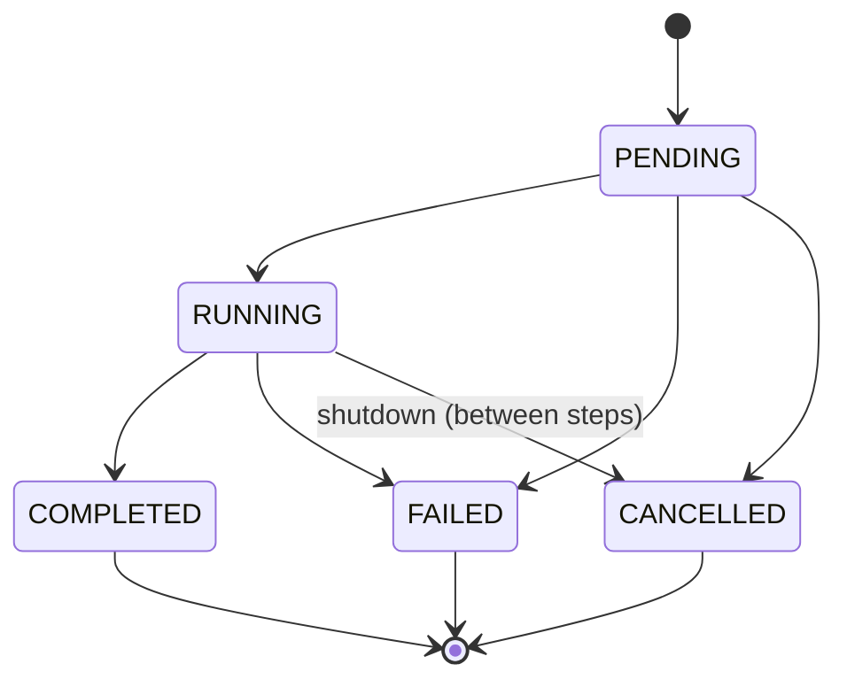

# Atlas Agent architecture

This document explains how Atlas Agent is put together and why. It covers the Electron process
split, the browser abstraction, the extension link, persistence and the task lifecycle (Phase 1),
and how search planning (Phase 2) fits in. Search planning itself is described in
[search-planning.md](search-planning.md).

## Overview



Two rules shape the code base:

1. **Electron is a thin shell.** Browser control, persistence, the WebSocket server, state
   machines and task execution live in plain TypeScript packages. They are unit-tested without
   Electron, and `apps/desktop/src/main` only wires them together.
2. **Dependencies point inwards through interfaces.** `agent-core` depends on interfaces (ports)
   such as `BrowserController`, `ExtensionChannel`, `TaskStore` and `BrowserEventRecorder`, never
   on Playwright, `ws` or SQLite directly. `search-planner` follows the same rule: it defines
   `SearchStores` and `InstitutionProvider` ports, and `@atlas/database` implements the stores.

Transcript-specific knowledge (countries, education levels, keywords, strategies) lives only in
`@atlas/search-planner`. `BrowserController`, `TaskRunner`, the Electron main process, the WebSocket
server and the extension contain none of it, so a planner for a different task can sit alongside.

### Packages

| Package                 | Responsibility                                                                                                                                                                         | Depends on                                                   |
| ----------------------- | -------------------------------------------------------------------------------------------------------------------------------------------------------------------------------------- | ------------------------------------------------------------ |
| `@atlas/agent-protocol` | zod schemas for every WebSocket message; shared state names (`AgentState`, `BrowserState`, …)                                                                                          | zod                                                          |
| `@atlas/logger`         | Structured log entries, redaction, rotating file / memory / console transports                                                                                                         | —                                                            |
| `@atlas/browser-core`   | `BrowserController` interface, `BrowserAction` union, generic executor, URL policy; Playwright implementation behind the `/playwright` subpath                                         | logger, playwright-core                                      |
| `@atlas/agent-server`   | Localhost WebSocket server: origin and loopback checks, one active extension, ping and idle detection, request correlation                                                             | agent-protocol, logger, ws                                   |
| `@atlas/database`       | `node:sqlite` driver wrapper, migrations, repositories (Phase-1 and search), `searchStoresOf()` adapter                                                                                | agent-protocol, search-planner (domain types and ports), zod |
| `@atlas/command-parser` | Phase-1 deterministic command → action plan                                                                                                                                            | browser-core                                                 |
| `@atlas/agent-core`     | State machines, `BrowserSession`, `TaskRunner`, `AgentService`                                                                                                                         | the above (via interfaces)                                   |
| `@atlas/search-planner` | Phase 2: search vocabulary, `SearchIntent`, institutions, strategies, query identity, `SearchPlanner`, `SearchCampaignService`, `SearchJobQueue`, `SearchProgressService`, store ports | logger, zod                                                  |
| `@atlas/desktop`        | Electron main/preload/renderer, IPC, configuration, adapters, shutdown                                                                                                                 | all packages                                                 |
| `@atlas/extension`      | Chrome MV3 service worker and popup                                                                                                                                                    | agent-protocol                                               |

Internal packages export TypeScript source (`"exports": "./src/index.ts"`). electron-vite and Vite
bundle them into the desktop app and the extension, so no per-package build step exists.

## Electron: renderer / preload / main

| Process                       | Can do                                                        | Cannot do                                                                            |
| ----------------------------- | ------------------------------------------------------------- | ------------------------------------------------------------------------------------ |
| **Renderer** (`src/renderer`) | Render React UI; call `window.atlas.*`                        | Access Node, `require`, `ipcRenderer`, the filesystem or the network outside its CSP |
| **Preload** (`src/preload`)   | Expose a fixed object of typed functions with `contextBridge` | Pass through arbitrary channels                                                      |
| **Main** (`src/main`)         | Everything: services, windows, IPC handlers                   | —                                                                                    |

Window hardening (`window/create-main-window.ts`):

- `contextIsolation: true`, `nodeIntegration: false`, `sandbox: true`, `webSecurity: true`, no
  `<webview>`
- `window.open` is denied, and navigation away from the bundled UI is blocked
- All web permission requests (camera, notifications, …) are denied for the Electron session
- A strict Content-Security-Policy (`script-src 'self'`)
- A single-instance lock, so two Atlas processes never share the profile or port

### IPC contract

`src/shared` is imported by all three processes:

- `ipc-channels.ts` is the complete whitelist. Invoke channels are `browser:launch`,
  `browser:stop`, `task:run`, `agent:get-status`, `extension:get-status` and `logs:subscribe`,
  plus the Phase-2 channels `search:create-campaign`, `search:plan-campaign`,
  `search:list-campaigns`, `search:get-campaign`, `search:get-progress` and `search:list-jobs`.
  Push events are `agent:status-changed` and `logs:entry`. No other string is ever used as a channel.
- `ipc-types.ts` defines the `AtlasApi` exposed as `window.atlas` and every payload type, including
  the search data transfer objects.
- `search-vocabulary.ts` repeats the search status and level values as dependency-free literals,
  because the renderer cannot import `@atlas/search-planner` (it uses Node APIs). A unit test keeps
  them identical to the domain.
- `ipc-schemas.ts` (Phase 1) and `main/ipc/search-ipc-schemas.ts` (Phase 2) hold the zod schemas
  for renderer → main payloads.

Every handler (`main/ipc/ipc-handlers.ts`):

1. checks that the sender frame URL is the Atlas renderer (dev server origin or the bundled file);
2. validates the payload with zod (unknown keys rejected; channels without a payload reject one);
3. refuses new work once shutdown has begun;
4. returns `{ ok: true, data } | { ok: false, error: { code, message } }`. Errors are sanitized
   and never rely on Electron's error serialization.

## Browser control

### `BrowserController`

```ts
interface BrowserController {
  readonly isRunning: boolean;
  launch(): Promise<void>;
  close(): Promise<void>;
  goto(url: string): Promise<void>;
  click(selector: string): Promise<void>;
  type(selector: string, text: string): Promise<void>;
  press(selector: string, key: string): Promise<void>;
  scroll(direction: 'up' | 'down', amount?: number): Promise<void>;
  getPageTitle(): Promise<string>;
  getCurrentUrl(): Promise<string>;
  getPageText(): Promise<string>;
  onDisconnected(listener: () => void): () => void;
}
```

`PlaywrightBrowserController` is the only code that imports Playwright. It:

- launches **installed Google Chrome** (`channel: "chrome"`, or `ATLAS_CHROME_EXECUTABLE`) with
  `chromium.launchPersistentContext(<userData>/browser-profile)`, headed, with the real window
  size;
- keeps Chrome's normal protections that Playwright disables by default. Extensions stay allowed,
  cookies keep OS-backed encryption (no mock keychain or basic password store), and phishing
  detection and popup blocking stay on. The automation infobar is left visible;
- applies action and navigation timeouts, and maps Playwright failures to `BrowserError` codes
  (`CHROME_NOT_FOUND`, `PROFILE_IN_USE`, `TIMEOUT`, `NAVIGATION_FAILED`, `BROWSER_NOT_RUNNING`, …)
  with actionable messages;
- allows navigation only to `http`/`https` URLs without embedded credentials;
- after `press`/`click`, briefly waits for a navigation to start and, if one does, for the new
  document to load;
- logs every operation (start, completion with duration, failure). It logs only the length of
  typed text, never the text;
- distinguishes `close()` from Chrome being closed by the user and emits `onDisconnected` for the
  latter.

### Actions and the generic executor

Planners produce serializable `BrowserAction`s (`navigate`, `click`, `fill`, `press`, `scroll`).
`executeBrowserAction(controller, action)` maps each action to one controller call and contains no
site knowledge. All site-specific decisions (selectors, URLs) belong to whoever produced the plan.

### `BrowserSession`

`BrowserSession` (agent-core) owns the browser state machine on top of a controller and serializes
launch/stop so rapid clicks cannot race:



`DISCONNECTED` is shown in the UI as **Disconnected**, and `STOPPED` as **Not Running**.

## WebSocket link to the extension

### Server (`@atlas/agent-server`)

- Binds to **`127.0.0.1` only**, on `ATLAS_AGENT_PORT` (default 47821).
- Accepts a connection only if the remote address is loopback **and** the `Origin` is
  `chrome-extension://<id>` for an allowed ID. The default allowlist is the Atlas extension's fixed
  ID, set through the manifest `key`. Web pages cannot forge `Origin`, so websites cannot talk to
  the agent.
- Frames are limited to 64 KB, text only, and validated with the shared zod schemas. A connection
  that sends 5 invalid messages is closed.
- A connection counts as **CONNECTED** only after `EXTENSION_CONNECTED`. A newer connection
  replaces an older one.
- The server sends `PING` every 20 s and drops connections that have been silent for 60 s.

### Protocol (`@atlas/agent-protocol`)

Every message has the envelope `{ v: 1, id, sentAt, type, payload }`. The schemas in
`messages.ts` are the single definition; TypeScript types are inferred from them and used by both
sides.

| Direction           | Type                  | Payload                                     |
| ------------------- | --------------------- | ------------------------------------------- |
| Extension → Desktop | `EXTENSION_CONNECTED` | `{ extensionVersion }`                      |
| Extension → Desktop | `PAGE_CHANGED`        | `{ reason: 'activated' \| 'updated', tab }` |
| Extension → Desktop | `PAGE_METADATA`       | `{ requestId, tab \| null }`                |
| Extension → Desktop | `HEARTBEAT`           | `{ replyTo? }`                              |
| Desktop → Extension | `PING`                | `{}`                                        |
| Desktop → Extension | `GET_PAGE_METADATA`   | `{ requestId }`                             |
| Desktop → Extension | `TASK_STATUS`         | `{ taskId, status, command, message? }`     |

`tab` is `{ tabId, windowId, url, title, status, incognito, favIconUrl? }`, read from the
`chrome.tabs` API only.



`WebSocketExtensionChannel` (desktop) adapts the server to agent-core's `ExtensionChannel` port.

## Chrome extension

- **Manifest V3**, module service worker, permissions `tabs` and `alarms` only. There are no host
  permissions and no content scripts, so it never reads page content.
- `AgentConnection` is a self-healing client. It retries with exponential backoff (1 s → 15 s),
  sends heartbeats while connected (which also keeps the service worker alive in Chrome 116+),
  answers `PING`, and ignores events from stale sockets.
- A `chrome.alarms` alarm every 30 s calls `ensureConnected()`. It restores the connection if
  Chrome suspended the service worker and dropped its timers.
- Listeners are registered synchronously at service worker start-up, as MV3 requires.
- `PAGE_CHANGED` is sent (debounced) on tab activation, completed loads, title changes and window
  focus.
- The **popup** asks the service worker for its state over `chrome.runtime` messaging and shows the
  desktop connection, current page title, URL and last task status. It uses `textContent` only.
- The agent port is injected at build time (`ATLAS_AGENT_PORT`), so no `storage` permission is
  needed.

## Persistence

`@atlas/database` uses Node's built-in **`node:sqlite`**. It was chosen over native modules such as
better-sqlite3 because the same code must run under Node for tests and under Electron at runtime,
and a native module would need a separate ABI build for each and C++ toolchains on developer
machines. The driver is hidden behind a five-method `SqliteDatabase` interface.

- **Location:** `<userData>/data/atlas.db`, WAL journal, `foreign_keys=ON`, `busy_timeout=5000`.
- **Migrations:** `src/migrations/NNNN-name.ts` files, listed in order in `migrations/index.ts`, each
  applied in a transaction and recorded in `schema_migrations`. A database containing an unknown
  (newer) version is refused. No `CREATE TABLE` exists outside migrations.
- **Repositories:** `AgentRunRepository`, `TaskRepository`, `BrowserEventRepository` and
  `CheckpointRepository`. Task status updates are guarded in SQL
  (`WHERE id = :id AND status IN (…)`), so an illegal transition throws even if caller logic is
  wrong. `CHECK` constraints enforce the status vocabularies and valid JSON.

```mermaid
erDiagram
  agent_runs ||--o{ tasks : "agent_run_id"
  tasks ||--o{ browser_events : "task_id (nullable)"
  tasks ||--o{ checkpoints : "task_id"
  agent_runs { text id PK; text started_at; text ended_at; text status }
  tasks { text id PK; text agent_run_id FK; text command; text status; text created_at; text started_at; text completed_at; text error_message }
  browser_events { text id PK; text task_id FK; text event_type; text url; text details; text created_at }
  checkpoints { text id PK; text task_id FK; text checkpoint_type; text data_json; text created_at }
```

- **Sessions:** each app start creates an `agent_runs` row (`RUNNING`) and ends it as `STOPPED` on
  graceful shutdown. At the next start, runs left `RUNNING` become `ABORTED` and unfinished tasks
  become `FAILED`.
- **Events:** browser lifecycle, extension connection, active page changes and each task action are
  recorded. URLs and details go through the log redaction first; typed values are never stored.
- **Search planning (Phase 2):**
  - Migration `0002` adds `search_sources` (with Scribd seeded), `search_campaigns` and
    `institutions`; migration `0003` adds `search_queries` and `search_jobs`.
  - Deduplication is enforced by `UNIQUE (campaign_id, query_hash)` and
    `UNIQUE (campaign_id, source_id, query_id)`.
  - The job queue claims jobs with a single guarded `UPDATE … RETURNING`.
  - Progress uses `GROUP BY` aggregates.
  - `AtlasDatabase.transaction()` is the unit of work that makes a whole plan atomic.

```mermaid
erDiagram
  search_campaigns ||--o{ search_queries : "campaign_id"
  search_campaigns ||--o{ search_jobs : "campaign_id"
  search_queries ||--o{ search_jobs : "query_id (same campaign)"
  search_sources ||--o{ search_jobs : "source_id"
  institutions ||--o{ search_queries : "institution_id (nullable)"
  institutions ||--o{ search_jobs : "institution_id (nullable)"
  search_campaigns { text id PK; text name; text status; text intent_json; text source_ids_json; text plan_summary_json; text last_error }
  search_queries { text id PK; text campaign_id FK; text country_code; text strategy_id; text query_text; text normalized_query; text query_hash; integer priority }
  search_jobs { text id PK; text campaign_id FK; text query_id FK; text source_id FK; text status; integer priority; integer attempt_count; integer current_page; integer discovered_count }
  institutions { text id PK; text country_code; text name; text normalized_name; text institution_type }
  search_sources { text id PK; text name; text base_url; integer enabled }
```

## Search planning (Phase 2)

The desktop composition root opens the database once and shares it between two runtimes:

- `agent-runtime.ts` (Phase 1): browser, WebSocket server and task runner.
- `search/search-runtime.ts` (Phase 2): calls `createSearchServices({ stores: searchStoresOf(database),
institutionProvider: new StaticInstitutionProvider(), logger })` and exposes a `SearchFacade`
  that maps domain objects to renderer DTOs.

The six `search:*` IPC handlers validate payloads with zod and use the same `IpcResult` pattern.
Search error codes map to `INVALID_REQUEST`, `NOT_FOUND` or `INVALID_STATE`.

Planning never touches the browser. `SearchJobQueue` is ready for future website adapters, which
will claim jobs and drive `BrowserController`; that integration is described in
[search-planning.md](search-planning.md#future-website-adapter-integration).

## Logging

`createLogManager({ transports, minLevel })` hands out component loggers
(`logs.forComponent('browser')`, `.child('playwright')`). Each entry is:

```json
{ "timestamp": "…", "level": "info", "component": "task", "message": "Opening wikipedia.org",
  "taskId": "…", "metadata": { … } }
```

Before an entry reaches any transport, the message and metadata are redacted:

- keys such as `password`, `cookie`, `token`, `authorization`, `session` and `apiKey`;
- sensitive URL query parameters (`access_token`, `code`, `sig`, …);
- `Bearer` and `Basic` credentials, cookie headers, JWTs, and `user:pass@` in URLs;
- ANSI codes (and Playwright call logs removed from error messages).

Transports in the desktop app:

- `RotatingFileTransport` writes JSON lines to `<userData>/logs/atlas.log`, 5 MB × 5 files, through
  an async write queue.
- `MemoryTransport` keeps a bounded buffer at `info`+ and feeds the UI: `LogBroadcaster` assigns
  sequence numbers and pushes entries to subscribed renderers.
- `ConsoleTransport` is used in development only.

## Task lifecycle



On any error inside the run, the task becomes `FAILED`. The sanitized message is stored in
`tasks.error_message`, an `ACTION_FAILED` event names the failing step, an error is logged, and
the outcome carries the message back to the UI. Nothing is swallowed: if even the failure cannot be
persisted, the error propagates to the IPC caller.



The agent state follows task progress: **IDLE → RUNNING → IDLE** on success, **→ ERROR** on
failure (a new task can still run), and **STOPPED** once shutdown begins. The extension state is
**DISCONNECTED ↔ CONNECTED**. All four machines are explicit transition tables in
`agent-core/src/state/transitions.ts`; an illegal transition throws.

### The Phase-1 command parser

`@atlas/command-parser` is **deterministic Phase-1 command handling, not a planner**. A two-rule
grammar (`<verb> <site>` and `<verb> <site> and search [for] <query>`) produces an intent. The site
is normalized through the same http(s)-only URL policy as the controller. Search is delegated to a
`SiteSearchHandler`; the only one is Wikipedia, which emits plain `navigate`, `fill` and `press`
actions. A future planner can replace it by implementing `CommandParser`.

## Graceful shutdown

`app.on('before-quit')` holds the quit until `runShutdownSteps` finishes. Steps run strictly in
order; each has a timeout, and a failing step is logged without blocking later ones:

1. `stop-accepting-tasks`: IPC refuses new work, the agent enters `STOPPED`, and a running task is
   cancelled at its next step.
2. `close-websocket-server`: the extension sockets close (code 1001), and the extension starts
   retrying.
3. `close-browser`: the Playwright context closes cleanly, so Chrome flushes cookies and session
   data. **The profile directory is never deleted.**
4. `flush-and-close-database`: the agent run is marked `STOPPED`, the WAL is checkpointed, and the
   connection closes. The composition root owns this step, because the agent and search runtimes
   share the database.
5. `unregister-ipc`, then `flush-logs`: "Agent stopped" is written and the file queue drained.

## Cross-platform notes

- All paths come from `app.getPath('userData')` plus `node:path`. Nothing is hardcoded, and
  `resolveAppPaths` is tested with both `path.win32` and `path.posix`.
- No shell commands are used in application code. Chrome is located by Playwright's channel
  resolution.
- Sender URL checks compare file paths case-insensitively on Windows and macOS.
