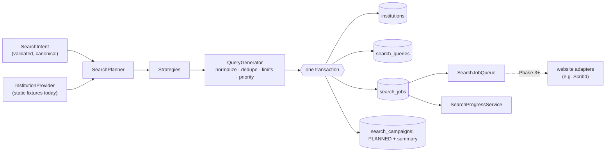
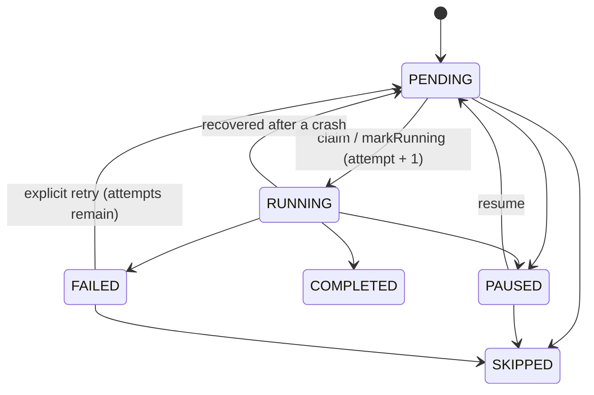

# Search planning (Phase 2)

Phase 2 turns a collection request, such as _"Diploma-level and higher academic transcripts for
Canada, the USA and the United Kingdom"_, into a **deterministic, persistent, de-duplicated set of
search jobs**.

> **Phase 2 generates and persists search work. It does not execute website searches.** No
> website is opened, searched or scraped. Jobs stay `PENDING` until a later phase adds website
> adapters that consume them.

All of this lives in `@atlas/search-planner`, a plain TypeScript package with no dependency on
Electron, Playwright or SQLite. Persistence is reached through ports implemented by
`@atlas/database`, and the desktop app only wires the pieces together and displays them.



## SearchCampaign

A **campaign** is one collection objective. It stores its intent, its selected sources and a
summary of the most recent planning run.

| Status      | Meaning                                                        |
| ----------- | -------------------------------------------------------------- |
| `DRAFT`     | Created, never planned                                         |
| `PLANNED`   | Jobs exist. Planning again keeps it `PLANNED`                  |
| `RUNNING`   | Reserved for execution (later phases)                          |
| `PAUSED`    | Reserved for execution                                         |
| `COMPLETED` | Reserved for execution                                         |
| `FAILED`    | Planning (or later, execution) failed. It can be planned again |
| `CANCELLED` | Terminal                                                       |

Transitions are an explicit table (`SEARCH_CAMPAIGN_TRANSITIONS`). The database applies status
updates with a guard (`WHERE status IN (…)`). Campaign status is separate from the Phase-1
browser `TaskStatus`.

If planning fails for a campaign that was never planned, the campaign becomes `FAILED` with a
sanitized `last_error`. If re-planning fails for a `PLANNED` campaign, its existing plan and jobs are
kept and only `last_error` is recorded.

## SearchIntent

```ts
interface SearchIntent {
  countries: string[]; // country codes: "CA", "US", "GB"
  educationLevels: EducationLevel[];
  includeInstitutions: boolean; // default true
  keywords: string[]; // transcript keyword IDs
  programNames?: string[];
  maxVariationsPerInstitution?: number; // default 5
}
```

The zod schema is built from a **vocabulary** (`createSearchIntentSchema(vocabulary)`), so other
assignments can supply their own countries, levels or keywords. It rejects:

- unknown or empty country lists, including country names instead of codes;
- invalid education levels and empty level lists;
- unknown or empty keyword lists;
- unknown fields.

Valid intents are **canonicalized**: codes are upper-cased, duplicates removed, and entries sorted
into vocabulary order. `["us", "CA", "US"]` and `["CA", "US"]` are therefore the same intent.

### Vocabulary for the transcript assignment

- **Countries** (`config/countries.ts`): the 48 assignment countries. Each has an **ISO 3166-1
  alpha-2 code** (the stored identifier, never the name), a display name, a spelled-out `queryName`
  (`St. Kitts & Nevis` → `Saint Kitts and Nevis`, `USA` → `United States`) and unambiguous aliases.
  Every listed territory has an ISO code, so no internal codes are needed yet; `codeType` allows them
  later.
- **Education levels** (`config/education-levels.ts`): `DIPLOMA`, `ADVANCED_DIPLOMA`, `ASSOCIATE`,
  `BACHELOR`, `POSTGRADUATE_DIPLOMA`, `MASTER`, `DOCTORATE`, `OTHER_HIGHER_EDUCATION`. Each has a
  rank (for "Diploma and above"), a short list of `queryTerms` (e.g. `bachelor`, `BSc`) and a wider
  recognition `vocabulary` (`bachelor's`, `undergraduate`, `BEng`, …).
- **Transcript keywords** (`config/transcript-keywords.ts`): ten concepts (`transcript`,
  `academic-transcript`, `academic-record`, `statement-of-results`, `mark-sheet`, `grade-sheet`,
  `degree-transcript`, `university-transcript`, `college-transcript`, `academic-statement`). Each
  has equivalent spellings (`mark sheet`, `marksheet`, `mark sheets`, `marksheets`) and a 0–100
  priority. No two terms normalize to the same text.

## InstitutionProvider

```ts
interface InstitutionProvider {
  readonly name: string;
  getInstitutions(countryCode: string): Promise<Institution[]>;
}
```

Phase 2 ships `StaticInstitutionProvider` with a **small fixture set**: 22 institutions across
Canada, the USA, the United Kingdom, Nigeria and Australia. It is not a registry; planning for other
countries uses country-level strategies only. Real discovery or import (registries, CSV, APIs)
implements the same interface later.

Institution IDs are deterministic (`ca-university-of-toronto`). The planner validates provider data,
removes duplicates by ID and by normalized name within a country, and sorts by normalized name.
In the database an institution is unique per `(country_code, normalized_name)`.

## Strategies

A strategy is a pure function from a planning context to query candidates. The planner never
builds the full country × institution × level × keyword product; each strategy produces one
purposeful kind of query:

| Strategy                      | Shape                                                                                                                      | Example (real output)                          |
| ----------------------------- | -------------------------------------------------------------------------------------------------------------------------- | ---------------------------------------------- |
| `INSTITUTION_BROAD`           | `"<institution>" <primary keyword>`                                                                                        | `"University of Toronto" transcript`           |
| `INSTITUTION_LEVEL`           | `"<institution>" <level term> <primary keyword>`                                                                           | `"University of Toronto" bachelor transcript`  |
| `PROGRAM_SPECIFIC`            | `<country> "<program>" <primary keyword>` and `"<institution>" "<program>" <primary keyword>`; only with explicit programs | `Canada "Computer Science" transcript`         |
| `COUNTRY_BROAD`               | `<country> <every keyword spelling>`                                                                                       | `Canada academic transcript`                   |
| `COUNTRY_LEVEL`               | `<country> <level term> <primary keyword>`                                                                                 | `Canada diploma transcript`                    |
| `INSTITUTION_KEYWORD_VARIANT` | `"<institution>" <other keyword>`, at most `maxVariationsPerInstitution`                                                   | `"University of Toronto" statement of results` |

The **primary keyword** is the highest-priority selected keyword. Institution names are quoted
(exact-phrase intent). Queries are **source-independent**: nothing about Scribd appears in them.

For the desktop test campaign (Canada, USA, UK; Diploma, Bachelor, Master; all ten keywords;
14 fixture institutions) the planner produces **217 queries**: 14 institution-broad, 70
institution-level, 48 country-broad, 15 country-level and 70 keyword variants.

## SearchQuery and query identity

```ts
interface SearchQuery {
  id: string; // q_<sha256(campaign, hash)>
  campaignId: string;
  strategyId: SearchStrategyId;
  countryCode: string;
  institutionId: string | null;
  educationLevel: EducationLevel | null;
  transcriptKeywordId: string;
  program: string | null;
  queryText: string; // what a search box would receive
  normalizedQuery: string;
  queryHash: string; // SHA-256 hex of normalizedQuery
  priority: number;
}
```

`normalizeText` defines when two queries are the same search:

- Unicode NFKC, with diacritics removed from Latin letters (`Montréal` = `Montreal`);
- lower-case;
- whitespace collapsed;
- quotes removed (`"University of Toronto" transcript` = `University of Toronto transcript`);
- apostrophes and periods removed (`bachelor's` = `bachelors`, `B.Sc.` = `BSc`);
- `&` becomes `and`, and other punctuation becomes a space;
- `+` and `#` kept (`C++` ≠ `C`), and marks that matter in non-Latin scripts kept.

The hash is SHA-256 (`node:crypto`), never a runtime-specific hash. It is identical across runs,
machines and platforms. Query and job IDs are derived from it, so re-planning produces the same IDs.

## Deduplication

Duplicates are prevented at three levels:

1. **In memory.** Candidates with the same hash collapse into one, keeping the higher-priority
   candidate. `duplicatesRemoved` reports how many collapsed.
2. **In the database.**
   - `search_queries`: `UNIQUE (campaign_id, query_hash)`.
   - `search_jobs`: `UNIQUE (campaign_id, source_id, query_id)`.
   - A composite foreign key keeps each job in the same campaign as its query.
3. **On write.** Inserts use `ON CONFLICT DO NOTHING`, and the planner reports `newQueryCount` and
   `newJobCount`.

**The source is part of job identity.** One logical query becomes one job per enabled source
(Scribd today; more later), so running the same query on two websites is two jobs, not a
duplicate.

Re-planning an unchanged campaign inserts nothing. Re-planning is **additive**: it never deletes
queries or jobs, including ones that may already have run. Identical text in two countries (for
example two institutions with the same name) is one search; it is kept once, attributed to the
first country in canonical order.

## Planning limits

```ts
interface PlanningLimits {
  maxQueriesPerCountry: number; // default 300
  maxQueriesPerInstitution: number; // default 12
  maxTotalQueries: number; // default 5000
}
```

After deduplication, candidates are ranked by priority, then country order, institution order and
text. They are then accepted greedily until a limit is reached. The lowest-priority queries are
discarded first, so an institution keeps its broad and level queries before its keyword variants.

Nothing is truncated silently:

- `PlanningStatistics` reports `generatedCandidates`, `deduplicatedCandidates`,
  `duplicatesRemoved`, `acceptedQueries`, `discardedByLimit` and a per-limit breakdown, and
  `acceptedQueries + discardedByLimit === deduplicatedCandidates`.
- A warning is logged.
- `discardedByLimit` is stored in the campaign summary and shown in the UI.
- The campaign is still valid and `PLANNED`.

A test with a synthetic country of 5,000 institutions generates more than 50,000 unique candidates
and accepts at most `maxQueriesPerCountry`.

## Priority

Higher numbers are more valuable and are claimed first:

```
priority = base(kind) + floor(keyword.priority / 10) − 2 × variantIndex
```

| Kind                             | Base |
| -------------------------------- | ---: |
| Institution + transcript         |  900 |
| Institution + program            |  850 |
| Institution + level + transcript |  800 |
| Country + program                |  650 |
| Country + keyword                |  600 |
| Country + level + transcript     |  500 |
| Institution + other keyword      |  400 |

- The keyword bonus (0–10) prefers stronger terms (`transcript` over `academic statement`).
- `variantIndex` penalizes secondary spellings and level terms (`BSc` after `bachelor`).
- Bases are at least 50 apart, so bonuses and penalties never reorder kinds.
- Priorities are scores, not positions: nothing depends on specific values.

## SearchJob

```ts
interface SearchJob {
  id: string; // j_<sha256(campaign, source, hash)>
  campaignId: string;
  queryId: string;
  sourceId: string;
  countryCode: string;
  institutionId: string | null;
  status: 'PENDING' | 'RUNNING' | 'PAUSED' | 'COMPLETED' | 'FAILED' | 'SKIPPED';
  priority: number;
  attemptCount: number;
  currentPage: number;
  discoveredCount: number;
  createdAt: string;
  updatedAt: string;
  startedAt: string | null;
  completedAt: string | null;
  lastError: string | null;
}
```



Job status is separate from the Phase-1 browser `TaskStatus`: a job is long-running,
page-by-page search work, not one browser command.

## SearchJobQueue

`SearchJobQueue` is the API future workers use. It executes nothing itself.

| Method                                                                          | Behaviour                                                                          |
| ------------------------------------------------------------------------------- | ---------------------------------------------------------------------------------- |
| `getNextPendingJob(filter?)`                                                    | Peek: highest priority, then oldest (`priority DESC, created_at, rowid`)           |
| `claimNextPendingJob(filter?)`                                                  | Atomic `UPDATE … WHERE id = (SELECT … LIMIT 1) AND status = 'PENDING' RETURNING *` |
| `markRunning` / `markCompleted` / `markFailed(error)`                           | Guarded transitions; errors are sanitized                                          |
| `retry`                                                                         | `FAILED → PENDING` only while `attemptCount < maxAttempts` (default 3)             |
| `pause` / `resume`, `pauseCampaign` / `resumeCampaign`, `skip`                  | Guarded transitions                                                                |
| `incrementAttempt`, `updateCurrentPage` (monotonic), `incrementDiscoveredCount` | Only for `RUNNING` jobs                                                            |
| `recoverInterruptedJobs`                                                        | At start-up: `RUNNING → PENDING`, or `FAILED` when no attempts remain              |

`attemptCount` counts how many times a job was started. Retries are explicit; there is no timer
yet. Every guard lives in a single SQL statement, so several workers can share the queue without
schema changes. A test confirms that two workers on separate SQLite connections never claim the
same job.

## SearchProgressService

Progress comes from `GROUP BY` aggregates (`SqliteSearchProgressRepository`); jobs are never
loaded into memory to count them. It reports:

- `totalJobs`, `pendingJobs`, `runningJobs`, `pausedJobs`, `completedJobs`, `failedJobs`,
  `skippedJobs`, `completedPercent`;
- `byCountry` (total, completed, failed, remaining);
- `bySource`;
- `byInstitution` (only jobs tied to an institution).

`remaining` is pending + running + paused.

## Persistence

Migrations follow the existing numbered pattern:

| Migration                      | Tables                                                                                                      |
| ------------------------------ | ----------------------------------------------------------------------------------------------------------- |
| `0002-search-campaigns`        | `search_sources` (Scribd seeded as a configured, not automated, source), `search_campaigns`, `institutions` |
| `0003-search-queries-and-jobs` | `search_queries`, `search_jobs`                                                                             |

All tables use foreign keys, `CHECK` constraints for status and vocabulary columns, hash format and
non-negative counters, and indexes on campaign, country, status, source, institution, query hash
and the queue order. Adding a source is a row in `search_sources`; no schema change is needed.

The planner writes institutions, queries, jobs and the campaign status and summary in **one
transaction** through `SearchUnitOfWork`. A failure leaves no partial plan behind.

## Using it

```ts
const services = createSearchServices({
  stores: searchStoresOf(database), // @atlas/database adapter
  institutionProvider: new StaticInstitutionProvider(),
  logger,
});
const campaign = services.campaigns.createCampaign({
  name: 'Transcript Search Test',
  intent: {
    countries: ['CA', 'US', 'GB'],
    educationLevels: ['DIPLOMA', 'BACHELOR', 'MASTER'],
    keywords: ['transcript'],
  },
  sourceIds: ['scribd'],
});
const plan = await services.campaigns.planCampaign(campaign.id);
services.progress.getProgress(campaign.id);
```

In the desktop app, open **Search Campaigns**, click **Create Test Campaign**, then
**Generate Search Plan**.

## Future website adapter integration

A later phase adds, per source, a worker that:

1. calls `queue.claimNextPendingJob({ sourceId: 'scribd' })`;
2. reads the query text through the job's `queryId`;
3. drives the browser through the existing `BrowserController`. Site-specific selectors belong in
   the adapter, never in `BrowserController`, `TaskRunner`, the WebSocket server or the extension;
4. reports progress with `updateCurrentPage` and `incrementDiscoveredCount`, and stores discovered
   documents in its own tables linked to `search_jobs.id`;
5. finishes with `markCompleted`, or `markFailed(error)` followed by an explicit `retry` policy;
6. moves the campaign to `RUNNING`, `PAUSED` or `COMPLETED` using the existing transition table.

Other automation domains can reuse the same pattern with their own vocabulary, strategies and
provider, or a separate planner package.
